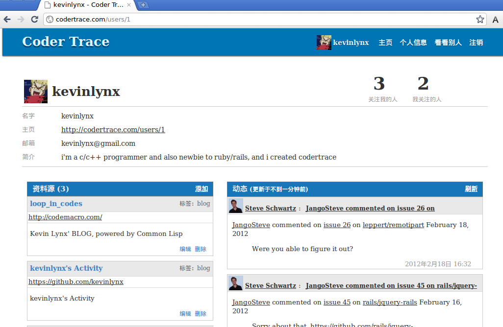

写了个简单的网站，codertrace.com
=====================================

简介
-----------

因为写 ext-blog_ 的原因，慢慢喜欢上github_ 。然后突然有一天产生了一个想法：如果可以把自己的博客_ 和 github主页_  集中到一块展示给别人，会不会是一种很方便的自我简介方式？然后我就动手写了 codertrace.com_ 。

所以， codertrace.com_ 这个网站的作用就是用来集中让程序员炫耀的。它通过RSS抓取，将你的博客，github主页，或其他有RSS输出的信息集中到一块展示给别人。这些信息通常就可以代表一个程序员。

如果你是程序员，也真不仿试试。

技术信息
-------------

不知道哪个王八蛋说的，程序员每一年得学一门新语言。我2010年末接触了Lisp，然后莫名其妙地写了 ext-blog_ ，又莫名其妙地在2011年末接触了Ruby。因为大学期间太痴迷C++，我勤奋努力，几乎通晓这门语言的各种细节；后来又稍微实践了下编译原理。在这若干年间，断断续续也接触过其他脚本类语言，我甚至在android上用java写过几个小应用_ 。基于这些积累，我发现我可以很快上手Ruby，然后再上手Rails，然后就有了 codertrace.com_ 。

所以， codertrace.com_ 就是一个Ruby on Rails的应用。当我用这货来做WEB的时候，我才发现曾经用Lisp写博客是多么geek。这种感觉就像你在用汇编写一个GUI程序一样。我的意思是，ruby/rails的世界里有太多现成的东西，但lisp的世界里没有。

而且，ruby是一个很爽的语言。我太喜欢它的closure语法，简洁，不需要加其他关键字就可以构造（例如其他语言map(function (item) xxxx end)，或者map(lambda (item) xxx )）。但我不喜欢在使用的地方通过yield去调用---这就像一个hack。我更不喜欢ruby用proc去封装closure。好吧，这其实是我自我分裂，为什么我要把ruby看成一个函数式语言？

脚本语言真是太酷了。

服务器信息
-------------

我很穷。不管你信不信，我真的舍不得花1000RMB买个VPS来架设 codertrace.com_ 。目前， codertrace.com_ 架设在 heroku.com_ ，而且还使用的是免费服务。免费服务竟然只有5M数据库。 codertrace.com_ 后台为了异步抓取用户提供的RSS，还使用了一个单独的进程(delayed_job ruby gem)。这也不是免费的，也许不久我就会收到 heroku.com_ 的账单。

为了实现自定义域名，我需要将 codertrace.com_ 指向 heroku.com_ 提供的IP。但也许你会同我一样愤怒，因为它提供的几个IP都被GFW墙了！所以，目前的实现方案是，我将 codertrace.com_ 指向了我博客对应的VPS，然后在VPS上使用nginx反向代理到 heroku.com_ 提供的IP。

故事
-------

作为一个宅男，在工作的若干年中，若干个假期我都用来打游戏，或者写程序。

所以，当这个成为习惯的时候， codertrace.com_ ，就顺理成章地消费了我今年的春节假期。我发现一个人窝在租的小房子里写代码是件很爽的事情。在当前这个社会环境下，你可以专注地去干件喜欢的事情，还不用处理各种生活琐事，真是太爽了。

但为什么我平时得不到这种感觉？因为，我，是一个没钱的程序员。我和我老婆租在一个标间里。在这样狭小的空间里，多个人就是多几倍干扰。这太残酷了。

当假期没了之后， codertrace.com_ 的开发进度就完全没了。因为当我每天下班回家之后，我实在提不起精力去继续写点代码，何况，我还得抵抗老婆的干扰。我又不能明目张胆地在公司里干工作之外的事，你们的公司允许吗？

末了
----------

曾经我以为我很牛逼，曾经我以为程序员很牛逼。后来我慢慢发现自己很垃圾。我没有写出来过牛逼的程序，大概也没能力写。还记得那个程序员的故事吗？就是有个傻逼也以为程序员很牛逼，但不幸在一家非IT公司的IT部门工作，他的程序员同事的工作就是每周填个excel表格。他后来很绝望，因为他没有为世界贡献过任何代码。后来，这货任性了，丢掉眼下的一切，直接去了大概是IT比较发达的城市。

.. _ext-blog: https://github.com/kevinlynx/ext-blog
.. _github: https://github.com
.. _github主页: https://github.com/kevinlynx
.. _博客: http://codemacro.com
.. _小应用: http://kevinlynx.iteye.com
.. _codertrace.com: http://codertrace.com
.. _heroku.com: http://heroku.com

