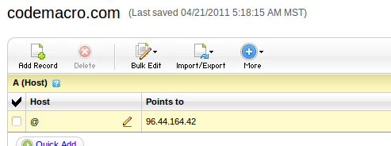

使用Lisp搭建独立博客
==========================

:Author: Kevin Lynx
:Date: 9.29.2011
:Contact: kevinlynx at gmail dot com

本文描述如何使用Lisp工具集搭建一个完整的个人博客站点。一个搭建好的例子站点可以参看我的个人博客：http://codemacro.com。

要搭建一个独立博客，需要两方面的支持。一是博客软件，二是根据选择的博客软件取得必须的“硬件“。例如我这里使用的是Lisp工具集，就需要一个可以完全控制的服务器，所以这里我需要一个VPS。当然，购买一个合适的域名也是必须的。以下将针对这些内容做描述。

获取VPS及域名
---------------

VPS提供商国内国外都有很多。我选择的是 rapidxen_ ，128M内存，1年70来美元，算是国外比较便宜的，速度上还过得去。

购买了VPS后，可以进入后台管理页面安装VPS操作系统。同样，因为我使用的是Lisp，我选择安装了Debian 6.0 squeeze (minimal)64位。实际上我更倾向于32位，因为我的PC系统就是32位，方便测试。安装系统非常简单，基本随意设置下即可。值得注意的是，除了修改root密码外，最好修改下ssh端口，具体设置方法可以另行搜索。此外，因为后面我会使用nginx作为HTTP前端服务器，为了方便安装nginx，最好更新下软件源列表，编辑etc/apt/source.list::

    deb http://ftp.us.debian.org/debian squeeze main
    deb http://packages.dotdeb.org stable all
    deb-src http://packages.dotdeb.org stable all
    deb http://php53.dotdeb.org stable all
    deb-src http://php53.dotdeb.org stable all

购买VPS最主要的，就是获取到一个独立IP，如图：

.. image:: imgs/vps.png

然后可以去购买域名。同样，也有很多域名服务商。这里我选择的是 godaddy_ ，我选择的域名codemacro.com一年11美元。购买了域名后，就需要将域名和VPS IP关联起来。详细设置也可以另行搜索。这里简要提下：在成功登入godaddy后，选择My Account，进入自己的域名，选择DNS Manager，然后添加域名映射即可，如图：

通过以上设置后，你购买的域名就成功指向你购买的VPS地址了。可以通过ping来观察是否指向成功。

使用Lisp构建博客系统
------------------------

要在VPS上安装软件，首先需要SSH上你的VPS，例如：ssh -p 1234 root@codemacro.com。

这里使用的软件集包括：

* nginx，Web服务器
* SBCL_ ，Lisp编译器实现
* quicklisp_ ，可以方便自动下载、安装Lisp库的工具
* hunchentoot_ ，Lisp实现的Web服务器 
* ext-blog_ ，Lisp实现的博客系统

实际上，可以完全使用Lisp作为Web服务器，但我担心效率问题（对个人博客而言完全没这回事），所以使用了nginx作为Web服务器前端，将hunchentoot放在后面。

安装nginx
~~~~~~~~~~~~~~~~

在设置好debian软件源后，安装非常简单::

    apt-get install nginx

安装完后，因为要将HTTP请求转发给Lisp服务器，所以需要修改下配置::

    vi /etc/nginx/sites-avaiable/default

将/请求派发给Lisp服务器（假设监听于8000端口）::

    location / {
        proxy_pass http://127.0.0.1:8000;
        proxy_set_header Host $host;
        proxy_set_header X-Real-IP $remote_addr;
    }

然后可以启动nginx了::

    nginx

这个时候通过浏览器访问，会得到503 bad gateway的错误提示，因为hunchentoot还没开启。

安装Lisp相关软件
~~~~~~~~~~~~~~~~~~~~~

SBCL_ 同样可以通过apt直接安装::

    apt-get instal sbcl

装好SBCL后，就可以进一步安装quicklisp_ 。可以完全遵守quicklisp官方给的安装方法进行安装。大概就是先获取quicklisp.lisp文件，然后在SBCL中载入，根据提示即可。这里不再赘述。

安装好quicklisp后，就可以使用它安装很多Lisp软件/库了。quicklisp在安装一个Lisp库时，会自动下载并安装依赖库，就像apt-get一样。因为ext-blog并未收入到quicklisp的软件列表里，所以ext-blog需要手动安装。首先，在本地（非VPS上）获取ext-blog源码::

    git clone git://github.com/kevinlynx/klprj.git

上面的git是我个人存东西用的，暂时没将ext-blog单独放置。进入到ext-blog目录。该目录下有几个方便的脚本可以用于博客管理。首先将ext-blog打包并上传到VPS上，例如::

    ./upload-dist.sh root@codemacro.com 1234 /home/test

该脚本会调用make-dist.sh将ext-blog全部源码打包，然后使用scp拷贝该文件及update-blog.sh到VPS指定的目录里（这里是/home/test），然后ssh上VPS。期间会两次输入VPS系统的密码。然后以下操作将在VPS上完成。

首先进入到刚才拷贝文件的目录::

    cd /home/test

解压ext-blog.tar.gz::

    tar xvf ext-blog.tar.gz

然后ext-blog被解压到/home/test/dist目录。进入此目录运行SBCL::

    cd dist
    sbcl

ext-blog目录下dep.lisp会使用quicklisp安装依赖库，进入SBCL后，载入该文件即可安装所有依赖库，这可能需要一点时间::

    (load "dep.lisp")

在没有其他问题下，可以暂时退出SBCL完成一些其他准备工作。

ext-blog在最近的版本中加入了验证码生成功能，这需要一个pcf字体文件。因为字体文件一般较大，所以upload-dist.sh脚本并没有将该字体文件打包，所以这里需要手动复制，同样在本地的ext-blog目录下::

    scp -P 1234 data/wenquanyi_12ptb.pcf root@codemacro.com:/home/test/dist/data/

另外，因为需要将Lisp解释器放置在系统后台执行，避免关掉SSH会话后终止SBCL进程，所以这里需要个工具gnu screen。可以使用apt-get来安装::

    apt-get install screen

然后，一切就OK了。在VPS上可以使用ext-blog目录下的run-blog.sh来运行这个博客（首先确定VPS上的nginx开启）::
    
    ./run-blog.sh

该脚本会使用screen在后台开启一个SBCL进程，并自动载入ext-blog，然后在8000端口上开启HTTP服务。这个启动过程可能会使用几十秒的时间，直接ctrl+z退出screen，这并不终止SBCL。一段时间后便可在浏览器里测试。

设置博客
~~~~~~~~~~~~~

如果一切正常，此时通过浏览器访问你的站点时，会被重定向到一个博客初始化页面，如下：

.. image:: imgs/initblog.png

上图中我是在本机测试的，所以域名是localhost，希望不至于产生误解。初始化仅需输入用户名和密码即可，以后可通过该用户名和密码进入博客后台管理页面。完成这一步后，就可以进入博客后台管理页面做更多的设置，例如博客标题等。

ext-blog的管理页面使用了emlog博客系统的CSS及其他资源，因此有同学觉得管理页面很面熟就不奇怪了。ext-blog提供在线编辑博客功能，同时也支持简单的metaweblog API，因此可以使用一些博客客户端来发表文章（仅测过我自己写的博客客户端cl-writer）。

最后
---------

本文描述较为粗略，主要是很多细节我自己也记不清。如有问题可以发邮件给我。

.. _rapidxen: http://www.rapidxen.net/
.. _godaddy: http://www.godaddy.com/
.. _SBCL: http://www.sbcl.org
.. _quicklisp: http://www.quicklisp.org/
.. _ext-blog: http://codemacro.com/view/8
.. _hunchentoot: http://weitz.de/hunchentoot/

